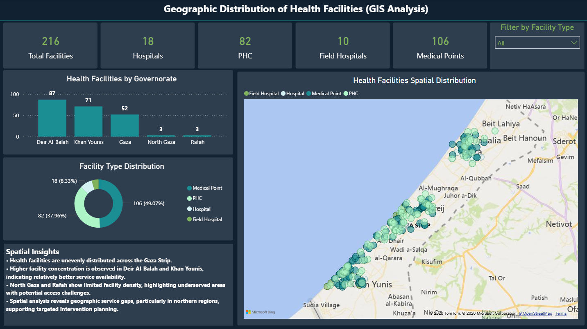
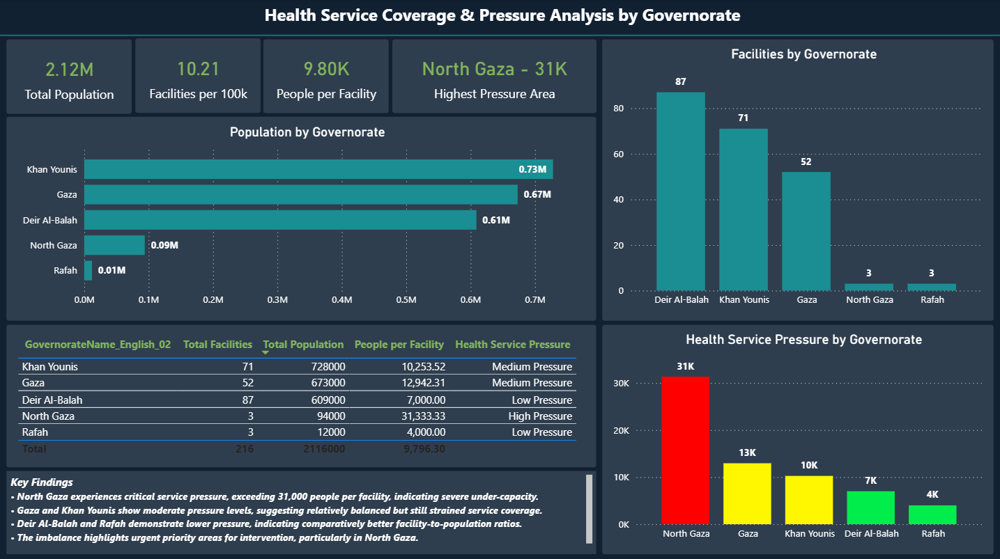
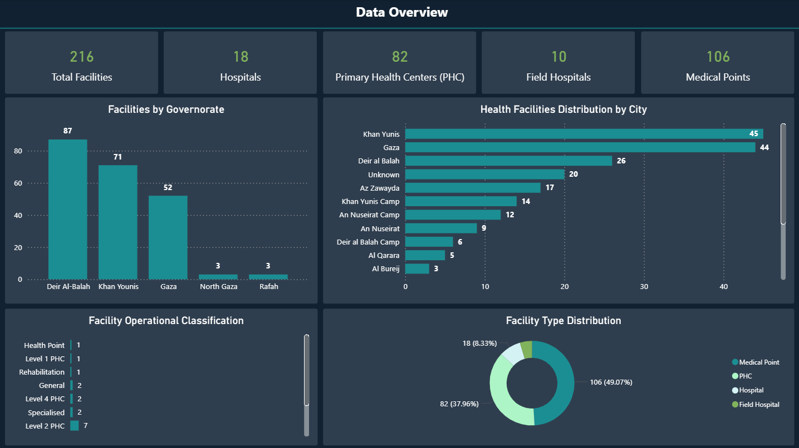
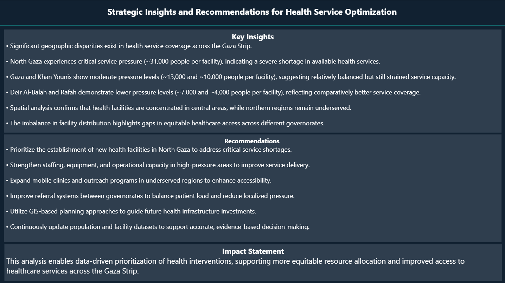

# 🏥 Gaza Health Facilities Analysis (Power BI + GIS)

🚨 **Data-driven insights for healthcare service optimization in Gaza**

---

## 📌 Project Overview
This project provides a comprehensive analysis of health facility distribution and healthcare service coverage across the Gaza Strip.

It integrates **Power BI dashboards**, **GIS spatial analysis**, and **Python-based data extraction** to support evidence-based decision-making in humanitarian contexts.

---

## 🎯 Objectives
- Analyze spatial distribution of health facilities  
- Measure service pressure (People per Facility)  
- Identify underserved and high-need areas  
- Support strategic healthcare planning  

---

## 🛠️ Tools & Technologies
- **Power BI** – Data modeling & visualization  
- **Python** – Web scraping & data extraction  
- **Power Query** – Data cleaning & transformation  
- **GIS Mapping** – Spatial analysis  

---

## 🌐 Data Source
Data was collected using Python scripts from WHO-related sources and combined with population datasets.

---

## 📊 Key Insights
- 🔴 North Gaza experiences **critical pressure (~31K people per facility)**  
- 🟡 Gaza & Khan Younis show **moderate pressure (~10K–13K)**  
- 🟢 Deir Al-Balah & Rafah have **lower pressure levels**  
- 📍 Significant geographic disparities exist in healthcare access  

---

## 💡 Recommendations
- Establish new facilities in high-pressure areas  
- Expand mobile clinics and outreach programs  
- Improve referral systems between regions  
- Strengthen healthcare capacity and resources  
- Use GIS for future planning and investment  

---

## 📷 Dashboard Preview

### 🌍 GIS Spatial Distribution

---

### 📊 Coverage Analysis

---

### 📈 Data Overview

---

### 🧠 Key Insights & Recommendations

---

## 🚀 Impact
This project demonstrates how data analytics can support:
- Better resource allocation  
- Improved healthcare accessibility  
- Evidence-based humanitarian decision-making  

---

## 👤 Author
**Basel Alserr**  
Data Analyst | Power BI | GIS | Humanitarian Data  

---

## ⭐ If you found this useful, feel free to star the repo!
